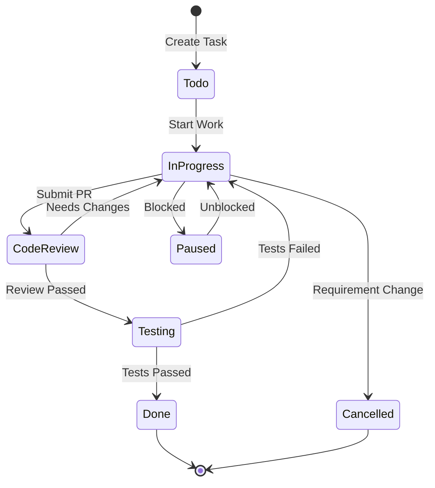

# ExcelGPT Task Management Template

## Task Structure Definition

### Task Hierarchy
```
L0: Strategic Goals - 6-12 months
└── L1: Milestones - 3-6 months
    └── L2: Phase Goals - 1-3 months  
        └── L3: Epics - 2-4 weeks
            └── L4: User Stories - 1-2 weeks
                └── L5: Tasks - 1-3 days
                    └── L6: Subtasks - hours
```

## Task Template

### 📋 Standard Task Template
```markdown
## [TaskID] Task Title

**Level**: L[0-6]
**Priority**: P[0-3] (P0 is highest)
**Status**: 🔴Todo | 🟡In Progress | 🟢Done | ⏸️Paused | ❌Cancelled
**Estimated Time**: [X]h/d/w
**Actual Time**: [X]h/d/w
**Assignee**: @[name]
**Due Date**: YYYY-MM-DD

### 📝 Task Description
[Detailed description of the task, background, and objectives]

### ✅ Acceptance Criteria
- [ ] Criterion 1
- [ ] Criterion 2
- [ ] Criterion 3

### 🧪 Testing Requirements
- **New Features**: Must write unit or integration tests.
- **Bug Fixes**: Must write regression tests.
- **Details**: All tests must comply with **[TESTING_CONVENTION.md](TESTING_CONVENTION.md)**.

### 🔗 Dependencies
- Prerequisite Tasks: [TaskID]
- Subsequent Tasks: [TaskID]
- Related Tasks: [TaskID]

### 📊 Progress Updates
- [Date] - [Progress Description]
- [Date] - [Progress Description]

### 🚧 Risks & Issues
- [Risk/Issue Description]
- [Solution]

### 📎 Related Resources
- Docs: [link]
- Code: [link]
- Design: [link]
```

## Task Tagging

### Tech Stack Tags
- `#frontend` - Frontend
- `#backend` - Backend
- `#ai` - AI/ML
- `#infra` - Infrastructure
- `#database` - Database
- `#devops` - DevOps

### Feature Module Tags
- `#chat-excel` - ChatExcel module
- `#agent` - Agent system
- `#auth` - Authentication/Authorization
- `#api` - API
- `#ui-ux` - UI/UX
- `#perf` - Performance

### Task Type Tags
- `#feature` - New Feature
- `#bugfix` - Bug Fix
- `#refactor` - Refactor
- `#docs` - Documentation
- `#test` - Testing
- `#research` - Research

## Priority Definitions

### P0 - Urgent & Important
- Production issues
- Core feature blockers
- Security vulnerabilities
- **Response Time**: Immediate

### P1 - Important
- Core feature development
- Major bug fixes
- Performance issues
- **Response Time**: Within 24 hours

### P2 - Normal
- Feature enhancements
- Non-critical bugs
- Optimizations
- **Response Time**: Within this iteration

### P3 - Low Priority
- Nice-to-have features
- Minor optimizations
- Technical debt
- **Response Time**: Next iteration

## Task Status Flow



## Daily Task Management Process

### Morning (9:00)
1. Review PROJECT_TODOS.md
2. Update task statuses
3. Set today's goals
4. Sync to TodoWrite

### During Work
1. Mark task as "In Progress" when starting
2. Record issues promptly
3. Update status immediately upon completion
4. Add new tasks as soon as discovered

### Before End of Day (18:00)
1. Update all task progress
2. Record today's accomplishments
3. Prepare tasks for tomorrow
4. Sync to file system

## Weekly Review Template

### 📅 Weekly Summary - Week [X]

#### Completion
- Planned Tasks: [X]
- Completed Tasks: [X]
- Completion Rate: [X]%

#### Key Achievements
1. [Achievement 1]
2. [Achievement 2]
3. [Achievement 3]

#### Issues Encountered
1. [Issue 1] - [Solution]
2. [Issue 2] - [Solution]

#### Next Week's Plan
1. [Task 1] - P[0-3]
2. [Task 2] - P[0-3]
3. [Task 3] - P[0-3]

#### Support Needed
- [Support 1]
- [Support 2]

## Task Management Best Practices

### 1. Task Breakdown Principles
- Single Responsibility: Each task does one thing
- Verifiable: Clear acceptance criteria
- Time-Controlled: Smallest task ≤ 3 days
- Independence: Minimize dependencies

### 2. Priority Management
- Only 1 P0 task per day
- No more than 3 P1 tasks
- Regularly reassess priorities
- Beware of urgent but unimportant tasks

### 3. Progress Tracking
- Update task status daily
- Record blockers and risks promptly
- Keep task descriptions up to date
- Use time tracking tools

### 4. Team Collaboration
- Clear task assignment
- Clear dependencies
- Communicate progress promptly
- Regular reviews and improvements

---
*Template Version: 1.0*
*Created: 2025-07-01*
*Maintainer: CLAUDE_md_Builder*

## ⚙️ Technical Safety Conventions

**IMPERATIVE: The following are mandatory technical red lines for all tasks.**

1.  **NEVER Overwrite, ALWAYS Append**
    - When modifying files like `.env`, `requirements.txt`, or other list-based config files, you **must** use append (not overwrite). This is the highest-priority rule to prevent data loss.

2.  **Evaluate Deletions Carefully**
    - Before deleting any code or files, assess their potential future value. If possibly useful, prefer archiving over direct deletion.

3.  **Use Virtual Environment**
    - All `pip` installs and `python` commands **must** be run in the project's `.venv` to ensure isolation and consistency.

---

## 📖 Protocol for Handling Large, Complex Tasks

**IMPERATIVE: This protocol is for turning large, vague tasks into clear, actionable plans.**

### Trigger Condition
- When a large task (e.g., L3 Epic or above, or any work expected to take more than 3 days) appears in `PROJECT_TODOS.md`, this protocol must be activated.

### Execution Process
1.  **Create Dedicated Management Files**:
    - **Must** create two new `.md` files named after the task:
      - `[TASK_NAME]_PLAN.md`
      - `[TASK_NAME]_PROGRESS.md`
    - *Example: For a task named "Exchange Testnet Integration", create `TESTNET_INTEGRATION_PLAN.md` and `TESTNET_INTEGRATION_PROGRESS.md`.*

2.  **Use Blueprint Templates**:
    - **Must** use files in the `reference_materials/` directory as templates:
      - `[TASK_NAME]_PLAN.md` **must** be based on the structure/content of `reference_materials/CHATEXCEL_ACTION_PLAN.md`.
      - `[TASK_NAME]_PROGRESS.md` **must** be based on `reference_materials/CHATEXCEL_PROGRESS.md`.

3.  **Update Main TODO List**:
    - The original large task in `PROJECT_TODOS.md` **must** be updated.
    - Its description should be simplified and **must** include links to the new `_PLAN.md` and `_PROGRESS.md` files for quick navigation.
    - *Example: `[ ] [INFRA-001] Exchange Testnet Integration (see: TESTNET_INTEGRATION_PLAN.md)`*

4.  **Execution & Tracking**:
    - Daily, detailed task updates should be made in the new `_PROGRESS.md` file.
    - The main task status (todo/in progress/done) in `PROJECT_TODOS.md` should stay in sync with the overall status in `_PROGRESS.md`.
