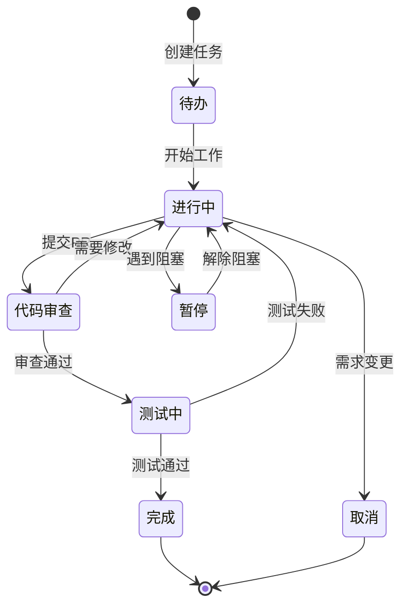

# ExcelGPT 任务管理模板

## 任务结构定义

### 任务层级
```
L0: 战略目标 (Strategic Goals) - 6-12个月
└── L1: 里程碑 (Milestones) - 3-6个月
    └── L2: 阶段目标 (Phase Goals) - 1-3个月  
        └── L3: 史诗任务 (Epics) - 2-4周
            └── L4: 用户故事 (User Stories) - 1-2周
                └── L5: 具体任务 (Tasks) - 1-3天
                    └── L6: 子任务 (Subtasks) - 数小时
```

## 任务模板

### 📋 标准任务模板
```markdown
## [任务ID] 任务标题

**层级**: L[0-6]
**优先级**: P[0-3] (P0最高)
**状态**: 🔴待办 | 🟡进行中 | 🟢完成 | ⏸️暂停 | ❌取消
**预计工时**: [X]h/d/w
**实际工时**: [X]h/d/w
**负责人**: @[name]
**截止日期**: YYYY-MM-DD

### 📝 任务描述
[详细描述任务内容、背景和目标]

### ✅ 验收标准
- [ ] 标准1
- [ ] 标准2
- [ ] 标准3

### 🧪 测试要求 (Testing Requirements)
- **新功能**: 必须编写单元或集成测试。
- **Bug修复**: 必须编写回归测试。
- **详情**: 所有测试都必须遵守 **[TESTING_CONVENTION.md](TESTING_CONVENTION.md)** 中的规范。

### 🔗 依赖关系
- 前置任务: [任务ID]
- 后续任务: [任务ID]
- 相关任务: [任务ID]

### 📊 进度更新
- [日期] - [进度描述]
- [日期] - [进度描述]

### 🚧 风险与问题
- [风险/问题描述]
- [解决方案]

### 📎 相关资源
- 文档: [链接]
- 代码: [链接]
- 设计稿: [链接]
```

## 任务分类标签

### 技术栈标签
- `#frontend` - 前端相关
- `#backend` - 后端相关
- `#ai` - AI/ML相关
- `#infra` - 基础设施
- `#database` - 数据库相关
- `#devops` - 运维相关

### 功能模块标签
- `#chat-excel` - ChatExcel模块
- `#agent` - Agent系统
- `#auth` - 认证授权
- `#api` - API相关
- `#ui-ux` - 界面体验
- `#perf` - 性能优化

### 任务类型标签
- `#feature` - 新功能
- `#bugfix` - Bug修复
- `#refactor` - 重构
- `#docs` - 文档
- `#test` - 测试
- `#research` - 研究探索

## 优先级定义

### P0 - 紧急重要
- 生产环境问题
- 核心功能阻塞
- 安全漏洞
- **响应时间**: 立即

### P1 - 重要
- 核心功能开发
- 重要Bug修复
- 性能问题
- **响应时间**: 24小时内

### P2 - 一般
- 功能增强
- 非关键Bug
- 优化改进
- **响应时间**: 本迭代内

### P3 - 低优先级
- Nice-to-have功能
- 小优化
- 技术债务
- **响应时间**: 下个迭代

## 任务状态流转



## 每日任务管理流程

### 早晨 (9:00)
1. 查看 PROJECT_TODOS.md
2. 更新任务状态
3. 确定今日目标
4. 同步到 TodoWrite

### 工作中
1. 任务开始时标记 "进行中"
2. 遇到问题及时记录
3. 完成后立即更新状态
4. 发现新任务立即添加

### 下班前 (18:00)
1. 更新所有任务进度
2. 记录今日完成情况
3. 准备明日任务
4. 同步到文件系统

## 周度回顾模板

### 📅 周度总结 - Week [X]

#### 完成情况
- 计划任务: [X]个
- 完成任务: [X]个
- 完成率: [X]%

#### 主要成果
1. [成果1]
2. [成果2]
3. [成果3]

#### 遇到的问题
1. [问题1] - [解决方案]
2. [问题2] - [解决方案]

#### 下周计划
1. [任务1] - P[0-3]
2. [任务2] - P[0-3]
3. [任务3] - P[0-3]

#### 需要的支持
- [支持项1]
- [支持项2]

## 任务管理最佳实践

### 1. 任务拆分原则
- 单一职责: 每个任务只做一件事
- 可验证: 有明确的完成标准
- 时间可控: 最小任务不超过3天
- 独立性: 尽量减少依赖

### 2. 优先级管理
- 每天只有1个P0任务
- P1任务不超过3个
- 定期重新评估优先级
- 紧急不重要的任务要警惕

### 3. 进度跟踪
- 每日更新任务状态
- 及时记录阻塞和风险
- 保持任务描述的更新
- 使用时间追踪工具

### 4. 团队协作
- 任务分配要明确
- 依赖关系要清晰
- 及时沟通进度
- 定期回顾和改进

---

*模板版本: 1.0*
*创建时间: 2025-07-01*
*维护者: CLAUDE_md_Builder*

## ⚙️ 技术安全约定 (Technical Safety Conventions)

**IMPERATIVE: 以下是执行所有任务时都必须遵守的、不可违反的技术红线。**

1.  **绝不覆盖，永远追加 (NEVER Overwrite, ALWAYS Append)**
    - 在修改如 `.env`, `requirements.txt` 或其他列表型配置文件时，**必须** 使用追加（Append）操作，而不是覆盖（Overwrite）。这是防止数据丢失的最高优先级规则。

2.  **审慎删除 (Evaluate Deletions)**
    - 在删除任何代码或文件之前，必须评估其未来潜在的价值。如果内容可能有用，优先选择归档（Archive）而不是直接删除。

3.  **使用虚拟环境 (Use Virtual Environment)**
    - 所有的 `pip` 安装和 `python` 执行命令，都**必须**在项目的 `.venv` 虚拟环境中运行，以确保环境的隔离性和一致性。

---

## 📖 大型复杂任务处理协议 (Protocol for Handling Large, Complex Tasks)

**IMPERATIVE: 此协议用于将大型、模糊的任务转化为清晰、可执行的行动计划。**

### 触发条件
- 当 `PROJECT_TODOS.md` 中出现一个大型任务（例如，L3 史诗级或以上，或任何预计耗时超过3天的工作）时，此协议必须被激活。

### 执行流程
1.  **创建专用管理文件**:
    - **必须**为该任务创建两个新的、以任务名命名的 `.md` 文件：
      - `[TASK_NAME]_PLAN.md`
      - `[TASK_NAME]_PROGRESS.md`
    - *示例: 对于名为 "对接交易所 Testnet" 的任务, 应创建 `TESTNET_INTEGRATION_PLAN.md` 和 `TESTNET_INTEGRATION_PROGRESS.md`。*

2.  **使用蓝图模板**:
    - **必须**使用 `reference_materials/` 目录下的文件作为创建新文件的模板：
      - `[TASK_NAME]_PLAN.md` **必须**基于 `reference_materials/CHATEXCEL_ACTION_PLAN.md` 的结构和内容。
      - `[TASK_NAME]_PROGRESS.md` **必须**基于 `reference_materials/CHATEXCEL_PROGRESS.md` 的结构和内容。

3.  **更新主 TODO 列表**:
    - 在 `PROJECT_TODOS.md` 中，原有的那个大型任务**必须**被更新。
    - 其描述应被简化，并**必须**包含指向新创建的 `_PLAN.md` 和 `_PROGRESS.md` 文件的链接，以便快速导航。
    - *示例: `[ ] [INFRA-001] 对接交易所 Testnet (详情参见: TESTNET_INTEGATION_PLAN.md)`*

4.  **执行与跟踪**:
    - 日常的、详细的任务更新应在新的 `_PROGRESS.md` 文件中进行。
    - `PROJECT_TODOS.md` 中的主任务状态（待办/进行中/完成）应与 `_PROGRESS.md` 的总体状态保持同步。
